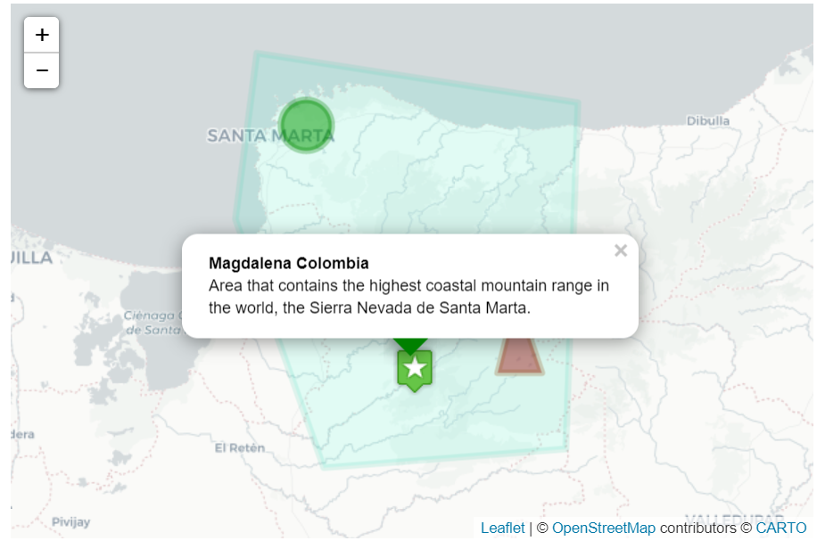

# leaflet_lab-gis
HTML/Leaflet Java lab for GIS

This lab rigths belong to the University of Auckland. Therefore the repository has no license, then all rights are reserved and it is not Open Source or Free. According to GitHub Terms of Service, other GitHub users have the right to view or fork it but not use it or modify it.

